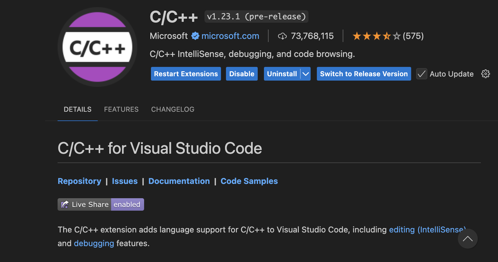
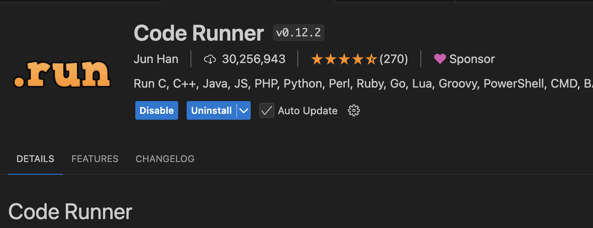
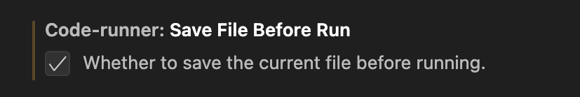
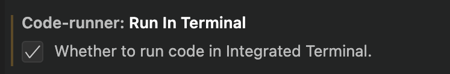

# Getting Started

### History
C++ is an **object-oriented programming language** that was created as an extension to the C language in 1979 by Bjarne Stroustrup at Bell Labs. The major difference is that C++ supports classes and objects while C does not. One of the strengths of C++ is the amount of control that is given to the programmer. Currently, C++ is the second most popular programming language in the world. 

While C++ is primarily known as an object-oriented programming language, it also falls under a few different programming paradigms. This includes **functional programming**, where functions and composite functions are the primary way that code is executed. 

Another area where C++ excels is concurrency programming. Concurrency programming allows the user to have multiple functions or blocks of code executed at once. This is useful for programs like video games, where functions must happen simultaneously. When creating C++, Stroustrup drew inspiration from the Simula programming language, which has concurrency features.

C++ was also designed to be a general-purpose, portable language. Stroustrup wanted to maintain these values from C when designing C++. C++ inherited all of the features of C and can be used with C compilers, making the language accessible and usable for all types of projects. 


Some of the uses of C++ include:  
- Video games
- Graphical applications and simulations
- Artificial Intelligence 
- Embedded software 
- Audio and video processing


For history, I used https://www.learncpp.com/cpp-tutorial/introduction-to-cplusplus/ & https://www.perforce.com/blog/qac/misra-cpp-history. 
To learn C++, I will be using:
  - https://www.w3schools.com/cpp/default.asp 
  - https://www.programiz.com/cpp-programming/
  - https://learn.microsoft.com/en-us/cpp/cpp/?view=msvc-170

When links are in parentheses for sections, that means that the code was taken or inspired by the code on the website given. 

### Downloading C++   
(from https://www.youtube.com/watch?v=Qw5qjRNlC-Y)   

To get started with C++, there are several steps you must follow.
1. Download a text editor. VSCode is a great text editor and the one that I will be using for this project. 
2. Two extensions to VSCode have to be downloaded.
3. The first is **C/C++**, which is shown here in this image:  
<div style="text-align: center;">
  
</div>    


4. The second is **Code Runner**. The extension is shown in this image: 

<div style="text-align: center;">
  
</div>

5. After doing this, two settings have to be changed.
6. The first is shown in this image: 
<div style="text-align: center;">
  
</div>

7. The second is shown in this image:
<div style="text-align: center;">
  
</div>

8. Download a compiler. For Macs, CLang is used. The command is **xcode-select --install**. If this is correctly installed, check your terminal to get these results: 

courtneysweeney@MacBook-Pro ~ % clang --version   
Apple clang version 16.0.0 (clang-1600.0.26.4)   
Target: arm64-apple-darwin23.5.0   
Thread model: posix   
InstalledDir: /Applications/Xcode.app/Contents/Developer/Toolchains/XcodeDefault.xctoolchain/usr/bin


### Hello World Program
Type this code into your program:

```cpp
#include <iostream>  
using namespace std;  

//This is a comment!
int main() { 
cout << "Hello World!"; 
return 0; 
}
```

This is an example of how all code runs in C++. Code is primarily contained in functions, with a "main" function as a requirement of every program. The "main" function always returns type "int" and ends with "return 0;". Unlike other object-oriented programming languages, code is not contained in classes. The iostream library is included to print "Hello World!", and using namespace std saves time so that std:: isn't included before every function. 

(from https://www.w3schools.com/cpp/cpp_getstarted.asp)

### Comments 

Single-line comments in C++ are signified using //. To end this comment, make a new line. To make a multi-line comment, begin the comment with /* and end it with */. 

### Compiling Code

There are two options to run this program. One is through VSCode, where there is a "run" option. The other is to select the corresponding terminal file and run it through the terminal. The latter is better for getting user input. Here is an image of what the terminal file looks like: 

<div style="text-align: center;">
  
</div>

Use either option to see that this code will run "Hello, World!", the first program programmers run when learning a new language.  
