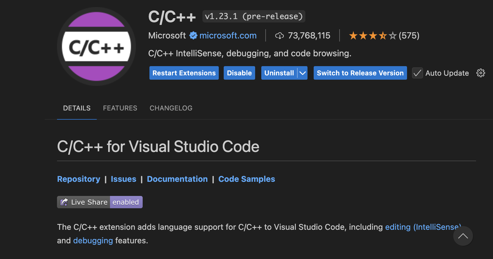
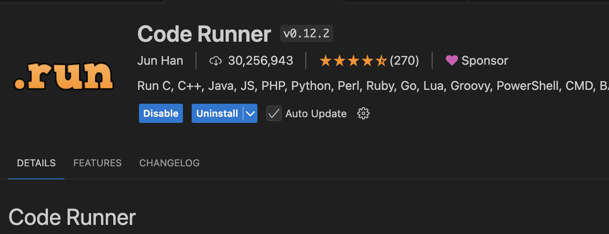

# C++ Project

Author: Courtney Sweeney

## Language Overview and Setup

### History
C++ is an **object-oriented programming language** that was created as an extension to the C language in 1979 by Bjarne Stroustrup at Bell Labs. The major difference is that C++ supports classes and objects while C does not. One of the strengths of C++ is the amount of control that is given to the programmer. Currently, C++ is the second most popular programming language in the world. 


Some of the uses of C++ include:  
- Video games
- Graphical applications and simulations
- Artificial Intelligence 
- Embedded software 
- Audio and video processing


For history, I used https://www.learncpp.com/cpp-tutorial/introduction-to-cplusplus/.  
To learn C++, I will be using:
  - https://www.w3schools.com/cpp/default.asp 
  - https://www.programiz.com/cpp-programming/
  - https://learn.microsoft.com/en-us/cpp/cpp/?view=msvc-170

### Downloading C++   
To get started with C++, you must first download a text editor. VSCode is a great text editor and the one that I will be using for this project. 

To begin, two extensions to VSCode have to be downloaded. The first is C/C++, which is shown here in this image:  
<div style="text-align: center;">
  
</div>


The second is Code Runner. The extension is shown in this image: 

<div style="text-align: center;">
  
</div>


There are two extensions that have to be downloaded. Code Runner and C/C++. Settings to run code, code runner enable run in terminal save file before run Clang xcode-select --install


### Hello World Program
Type this code into your program:

```cpp
#include <iostream>  
using namespace std;  

int main() { 
cout << "Hello World!"; 
return 0; 
}
```

(from https://www.w3schools.com/cpp/cpp_getstarted.asp)

This will run "Hello, World!", the first program programmers run when learning a new language.  

## Variables and Operators

Here are the rules for naming variables in C++:
- Variables **MUST** begin with a letter or an underscore 
- Variables can contain letters, digits, and underscores
- Case-sensitive 
- Variables cannot contain whitespace or special characters

### Some more information about variables and objects in C++:  
There are 98 reserved keywords in C++. This includes words like "bool", "break", "or", "public", and "if". Typically, programmers use **"CamelCase"** for C++, which means that words are separated by capitals. For example, "myNum" would be CamelCase. When a variable is declared, the type must also be declared before the name. Objects in C++ are **mutable** by nature but can be converted to immutable by using "const". The "const" keyword is short for constant, meaning that the variable will become a constant, or in other words, **immutable**. 

### Variable Types  
**Here are the basic data types for variables in C++:** (from https://www.w3schools.com/cpp/cpp_variables.asp)
1. **Integer:** an integer value (whole number) is stored with this data type
```cpp
int myNum = 8;
```
2. **Float:** a decimal value is stored with this data type
```cpp
float myFloat = 6.59;
```
3. **Double:** similar to a float, a decimal is stored with this data type. Doubles allow for more digits of the decimal to be stored, so they are a larger data type than floats and integers. 
```cpp
double myDouble = 9.78;
```
4. **Character:** a single character is stored with this data type
```cpp
char myLetter = 'C';
```
5. **Boolean:** a Boolean (true or false) is stored with this data type
```cpp
bool myBoolean = true;
```
6. **Pointers:** returns the address of the variable it is "pointing" to 
```cpp
string* ptr = &myString;
```
Pointers are a significant data type in C++. They are used to change values stored in variables directly. Pointers point to values on the stack, but can also be empty values pointing to the heap. When a pointer is empty, the C++ coder allocates memory on the heap.  

After a pointer has been created, it can be dereferenced to change the value stored at the address it is pointing to. 


7. **String:** text is stored with this data type 
```cpp
string myString = "Courtney";
```
***A note on strings:***   
In C++, the string library is a set of useful functions that can be used on strings in C++. This library is used by writing #include <string> at the top of the program. 

### Operations with Different Types 
There are many different operators used in C++. (from https://www.w3schools.com/cpp/cpp_operators.asp)
Some of these include: 
1. **Arithmetic Operators**
- (+) (addition)
- (-) (subtraction)
- (*) (multiplication)
- (/) (division)
- (%) (modulo, which gets the remainder)
2. **Relational Operators**
- (==) (is equal to)
- (!=) (is not equal to)
- (>) (is greater than)
- (<) (is less than)
- (>=) (is greater than or equal to)
- (<=) (is less than or equal to)
3. **Logical Operators**
- exp 1 **&&** exp2 (Logical **AND**)
- exp1 **||** exp2 (Logical **OR**)
- **!** exp (Logical **NOT**)
4. **Bitwise Operators**
- & (Binary AND)
- | (Binary OR)
- ^ (Binary XOR)
- ~ (Binary One's Complement)
- (<<) (Binary Shift Left)
- (>>) (Binary Shift Right)
5. **Assignment Operators**
- = (assigns value to a variable)
- += (if a += b, a = a + b)
- -= (if a -= b, a = a - b)
- *= (if a *= b, a = a * b)
- /= (if a /= b, a = a / b)
- %= (if a %= b, a = a % b)
6. **Other Operators**
- sizeof (returns size of data type)
- ? (returns value based on condition)
- & (memory address, used with pointers)
- . (accesses members of class objects, etc)
- -> (used with pointers to access class or variables)
- (<<) (prints the output value)
- (>>) (gets the input value) 
- ++ (increases the value by 1)
- -- (decreases the value by 1) 

  
Here, the previously declared variables from above are used to perform different operations. 
```cpp
    int mySum = myNum + myDouble;
    float mySum2 = myNum + myDouble;

    int myProduct = myNum * myDouble;
    float myProduct2 = myNum * myDouble;

    int myQuotient = myNum/myDouble;
    float myQuotient2 = myNum/myDouble;
    int myQuotient3 = myDouble/myNum;
    float myQuotient4 = myDouble/myNum; 
```

## Data Structures in C++   
C++ has many built-in complex data structures. Some of these include:   
1. **Arrays** (https://www.w3schools.com/cpp/cpp_arrays.asp)
Arrays store a collection of information that all **MUST** be the same data type. Here, "string" is declared when creating the array, so every piece of information in the array is a string.

```cpp
string myArray[5] = {"Courtney", "Liv", "Aubrey", "Sarah", "Kayla"};
```

2. **Maps** (https://www.w3schools.com/cpp/cpp_maps.asp)
Maps store information in key, value pairs in a similar way to a dictionary. 
```cpp
 map <string, int> dogs = { {"Tuukka", 7}, {"Chloe", 4}, {"Bentley", 12}, {"Cleo", 3}};
```

3. **Structures** (https://www.w3schools.com/cpp/cpp_structs.asp)
Structures store data in a similar way to a class. Instances can be created if a structure is named. Here, a struct named "MyStruct" is created and an instance is created. 

```cpp
struct MyStruct{             
  int myNum;         
  string myString;   
}
MyStruct myStructure;
myStructure.myNum = 2;
```

4. **Lists and Vectors** (https://www.w3schools.com/cpp/cpp_list.asp & https://www.w3schools.com/cpp/cpp_vectors.asp)
To create lists and vectors in C++, their libraries must be included. The list library is included through #include <list>, and vector included through #include <vector>. They function similarly; however, vector items can be indexed while list objects cannot be, while lists are better for adding and removing items from both ends. Here is an example of each:

**Vector:**
```cpp
vector <string> names = {"Courtney", "Liv", "Aubrey", "Kayla"};
```

**List:**
```cpp
list <string> names = {"Courtney", "Liv", "Aubrey", "Kayla"};
```

## Language Conventions 

C++ is a statically, strongly, and explicitly typed language. 
- **statically typed:** values are attached to types at composite time. 
- **strongly typed:** variables cannot be implicitly changed, must be explicitly changed. For example, if x = "5", x MUST be explicitly converted into an integer to be used as an integer
- **explicitly typed:** type of variable needs to be declared. For example, **int** x = 5 is the correct syntax, with "int" declaring the variable type.

Binding for identifiers and operators happens at compile time in C++, except when the virtual keyword is used. When virtual is used, binding occurs at runntime. (from https://www.geeksforgeeks.org/early-binding-late-binding-c/)

In C++, aliases can be used to create new identifiers for variable types. The "using" and "typedef" keywords are used to do this. Here, I will use the alias "str" for string. 

```cpp
using str = string;
```

Aliases can also be used with more complex types. For example, you could create a "func" type that has a specific input and output parameter. Here is an example: 

(from https://learn.microsoft.com/en-us/cpp/cpp/aliases-and-typedefs-cpp?view=msvc-170)
```cpp
using func = void(*)(int);

// func can be assigned to a function pointer value
void actual_function(int arg) { /* some code */ }
func fptr = &actual_function;
```

Here, func is created as a function that takes in an integer and returns a void. Then, a function that returns a void and takes in an integer is created. Then, a "func" is created that stored the address of the function that matches the parameters used by type "func". Now, the actual function can be called using fptr. 


## Functions 
(https://www.w3schools.com/cpp/cpp_functions.asp)

Programmers use functions extensively in C++. A "beautiful" program consists of a main program (a function in itself) that calls other functions. Here is an example of a function in C++:

```cpp
void myFunction(){
    cout << "Hello World!";
}
```
When called, this function will print "Hello World!" to the terminal.   

### The syntax of a function is as follows:  
**Header:** function output type | function name | (parameter type | parameter name)   
**Program delineator**: {} curly brackets delineate the function, which open following the header and closing the function after the final line.   

Some of the different types of output include int, string, and void. A void function, such as myFunction, will print to the screen. The **"main"** function in C++ is actually type **int**. This is because the final line is always "return 0;", which signals the end of the program.   

Here is the main function. It takes in no parameters and always returns 0. C++ programs **MUST** have this function to run. 

```cpp
int main(){
    cout << "Hello World!";
    return 0;
}
```

Here is an example of a function that has parameters and returns an integer to be used in the main function. 
```cpp
int multiplication(int num1, int num2){
    int product = num1 * num2;
    return product;
}
```
Notice the output type declaration and parameter type declarations. "Product" is what is returned, and it is an int, so this program will run. 

Functions in C++ can take in multiple parameters of multiple types. Here is an example of a function that takes in a string parameter and an int parameter and prints the values to the screen:

```cpp
void whatNumber(string name, int num){
   cout << "\nMy name is " << name << ", and this is my number: " << num; 
}
```

Functions in C++ cannot by nature return two values. However, there are a few different ways around that. One way around this is to use **arrays**. When arrays are changed inside of a function in C++, they are also changed outside of it. Here is an example of a function that splits a string into two and returns both strings by storing them in an array. 

```cpp
void splitter(string myString, string myArray[2]){
    char myChar = ' '; 
    int position = myString.find(myChar); 
    string myString1 = myString.substr(0, position); 
    string myString2 = myString.substr(position, -1); 
    myArray[0] = myString1; 
    myArray[1] = myString2; 
}
```

In that function, the values of the strings are stored in the array "myArray" which also exists outside of the function. These values can be accessed in other functions if the array is sent into that function, or can be accessed from main. 

The other way that functions can return two values in C++ is through **pointers**. Here, the function receives the addresses of two variables. It then uses the addresses to make a change in the function. Here, the address of a is the address of a variable x that lives in main. When the value at the address of a is changed, the value at the address of x is changed because **the address of a = the address of x**. This makes it so that values don't have to be returned to change the information stored at a value outside of the function. 

```cpp
void swap(int *a , int *b){  
    int temp = *a;  
    *a = *b;
    *b = temp;
}
```

C++ supports recursive functions. A recursive function is when a function calls itself. Here is an example of a recursive function that finds the factorial of a number. 

```cpp
double factorial(double myNum){
    if (myNum > 1) {
        myNum *= factorial(myNum - 1);
        return myNum;}
    else {
        return 1;
        }
    }
```
C++ supports both pass-by-reference and pass-by-value. Pass-by-value works when a function has a copy of a variable passed into it. Something must be returned in this instance so that any changes to the variable are meaningful. When a function uses pass-by-value, the original value stays the same. Here is an example of a function using pass-by-value in C++:

```cpp
double num2 = 6;
double num3 = 7;

int multiplication(int num2, int num3){
    int product = num2 * num3;
    num2 = 12; 
    return product;
}

int myProduct = multiplication(num2, num3);

```

Here, **num2** and **num3** are both sent into the function. In the function, the value of **num2** is changed to 12. However, this does not change the value of **num2** outside of the function because the **num2** in the function is only a copy. 

Pass-by-reference occurs when the reference to the address of a variable is passed into a function. In C++, this is achieved through pointers. When pointers are passed into a function, the value of a variable outside of the function can be changed directly. Here is an example of a function using pass-by-reference in C++:


```cpp
double num2 = 6;
double num3 = 7;
double product = 0;

void multiplication(int num2, int num3, double &a){
    a = num2 * num3; 
}

multiplication(num2, num3, product);
```

## Scoping and Stack Storage

The scoping of a language is where variables can be accessed. C++ is a statically scoped language, meaning the scope of the variable cannot change once the program is executed. 

In C++, variables created in functions are visible during the duration of that function and die when the function ends. If a variable is global, it is visible throughout the entire program and only dies when the program ends. Static variables are different. If a static variable is declared inside of a function, it is only visible inside of the function but lives until the end of the program. 

Scoping can cause side effects in languages where variables are changed when they are not supposed to be. In C++, using global variables and using pass-by-reference can create side effects. One of the guard rails in C++ is the "**const**" keyword, which causes the data in the variable to be unable to be changed. Another guardrail is to use variables only in the scope for which they were created. 

Variables are stored on the stack in C++. As functions and variables are called, they are pushed onto the stack and popped off once they are no longer needed. 

## Conditionals 
(https://www.w3schools.com/cpp/cpp_conditions.asp)

C++ uses the boolean values of "true" and "false". When a boolean is evaluated, C++ returns 1 for "true" and 0 for "false". 

C++ has a variety of conditional statements, including switches, bitwise statements, and if/else statements. 

Here is an example of a conditional statement with one condition. 

```cpp
void oneCondition(){
    int x = 8;
        if (x == 8){
            cout << "\nx is 8!";
        }
}
```
The syntax for if statements includes the condition in parentheses and the code to be executed in brackets. If there are more executable statements, C++ uses else if and the same syntax. 

```cpp
void ifElseStatements(){
    int a;
    int b = 17;
    cout << "I've thought of a number. Now, you type a number: ";
    cin >> a;
    if(a>b){
        cout << "Your number is bigger than my number! You chose " << a << " and I chose " << b << "!";
    }
    else if (a<b){
        cout << "Your number is smaller than my number! You chose " << a << " and I chose " << b << "!";
    }
    else{
        cout << "We chose the same number! You chose " << a << " and I chose " << b << "!";
    }

}
```

If/else statements can have multiple conditions. For or, C++ uses **&&** for the logical **AND**, **||** for the logical **OR**, and **!(statement)** for logical **NOT**. Here is an example of the logical **AND**. 

```cpp
void twoConditions(){
    int x = 8;
    int y = 10;
        if (x == 8 && y == 10){
            cout << "\nx is 8 and y is 10!\n";
        }
}
```

C++ allows switch statements. Switch statements compare the input to each case and execute based on when a case is matched. The break and default keywords can be used. If they aren't, the switch will then evaluate every piece of code after. **"Break"** will end the switch statement, and **"default"** is used to delineate code that should be evaluated if none of the cases are met. 

```cpp
void switchStatements(){

    int a = 4;
    
    switch(a){
        case 1:
            cout << "You are a Sunday!";
            break;
        case 2:
            cout << "You are a Monday!";
            break;
        case 3:
            cout << "You are a Tuesday!";
            break;
        case 4:
            cout << "You are a Wednesday!";
            break; 
        case 5: 
            cout << "You are a Thursday!";
            break;
        case 6:
            cout << "You are a Friday!";
            break;
        case 7:
            cout << "You are a Saturday";
            break;

    }
```

## Short-Circuiting in C++

C++ allows **short-circuiting**, which is used when evaluating the **&& (AND)** operator and the **|| (OR)** operator. Short-circuiting means that the computer only evaluates statements as necessary; for example, if a statement is an **"AND"** statement and the first condition is false, it will not evaluate the second condition. Here is an example of why it is important to know that C++ short-circuits: 

```cpp
void shortCircuiting(){
    if(8==7 && 0/0){
        cout << "This shouldn't ever print.";
    }
    else{
        cout << "Yay, C++ short-circuits!";
    }
}
```

Here, the second condition should cause the program to error. However, because C++ short-circuits, the program never reads the second condition because the first condition fails. 

## Dangling Else Problem in C++
In C++, the "dangling else" can be dealt with by correctly using curly brackets to delineate scope. Since C++ does not understand indentation, curly brackets need to be used so that the compiler knows which if the else is associated with. 

## Classes and Objects

(https://www.w3schools.com/cpp/cpp_classes.asp)

### Syntax

C++ is an object-oriented programming language. This means that programming in C++ revolves around the creation of many objects. Classes are used to create objects, which are instances of the class. 

Here is an example of a class. This class has three public attributes and a public method. When an instance of this class is created, it has all of the following attributes and has the method described in the class. Here, the class attributes do not have default values. **"string fName = "BLANK";"** where **"string fName;"** is would code a default value. 

To code a class, begin with the "class" keyword followed with the name of the class. Inside of the curly brackets for the class, the public, private, and protected keywords can be used to define the access of the attributes and methods. A class can have a mix of access for its attributes and methods. 

**Access Types:** 
1. Public: can be accessed from outside the class
2. Private: cannot be accessed from outside the class
3. Protected: can be accessed only from inherited classes

**Example Class**

```cpp
class Person {
        public: 
            string fName;
            string lName;
            string bDay;
            void toString(){
                cout << "Hello, " << fName << " " << lName << "!";
            }
    };
```

### String Method and the "Friend" Keyword

C++ supports the overriding of operators, which can be used to create a "String" method to print an object. C++ uses **cout <<** to print, so the operation to be overriden would be **<<**. 

Overriding uses references to point to existing variables. When overriding to create the string method, there are references to the output stream and to the object that is being made into a string. 

```cpp
//This is inside of the class "Student" and is public.
friend ostream& operator <<(ostream& os, const Student& st);

//This is outside of the class declaration.
ostream& operator <<(ostream& os, const Student& st){
    os << st.fName << " " << st.lName << " is a " << st.major << ".";
    return os;
}
```

(code inspiration: https://learn.microsoft.com/en-us/cpp/standard-library/overloading-the-output-operator-for-your-own-classes?view=msvc-170) 


**"Friend" Keywod**

Classes can use the keyword "friend" to allow other classes to use private and protected attributes and methods. In the example above, the "friend" attribute declares the ostream& operator function to use private and protected variables of the "Student" class. This is useful for writing string methods. 

(https://learn.microsoft.com/en-us/cpp/cpp/friend-cpp?view=msvc-170)

### Class Inheritance

C++ supports class inheritance. To have one class inherit from another, use this syntax: **class Child: public Parent{}**. This tells C++ to use the attributes and functions of the parent class. There is no "super" keyword in C++ like there is in Java and Python, as C++ understands when attributes of an object's parent class are called. Here is an example of inheritance, where the class Student inherits from the class Person. 

```cpp
class Student: public Person{
        public:
        //Student specific attributes 
            string major = "Undeclared";
            int id;
            //Student specific method 
            void declareMajor(){
                cout << "\nEnter major: ";
                cin >> major;
                cout << "Major updated to " << major << ".";
            }

};
```

**Multilevel and Multiple Inheritance**

C++ supports both multilevel and multiple inheritance. **Multilevel inheritance** occurs when an objects is derived from a child of a different class. If there was a "Student Athlete" class derived from the "Student" class, it would be the grandchild of the "Person" class. 

**Multiple inheritance** occurs when a class inherits from two parent classes. If there was a "Student" class and an "Athlete" class, a "Student Athlete" class could inherit from both of them. To do this, the syntax would be: **class StudentAthlete: public Athlete, public Student{}**. In this case, the StudentAthlete class would inherit the attributes of both an Athlete and a Student. 

**Overriding Functions**

When a class inherits from another class, it can override functions so that they are specific to that class. This is very useful since oftentimes classes need the same function (an animal noise function, for example) but need different outputs or uses from it (animals make different noises). 

Here is an example of a class overriding a function: 

**Original function in Person:**
```cpp
virtual void greeting(){
                cout << "Hello traveler!";
            }
```

**Overriden function in Student:**
```cpp
void greeting() override{
                cout << "You should be studying.";
            }
```

(code inspiration: https://en.cppreference.com/w/cpp/language/override)

There are two important keywords used in these functions: **virtual** and **override**. Virtual is used when a base class has a method that is expected to be overriden. This is required when trying to override a class, otherwise the program will error. 

The **virtual** keyword is also used when creating abstract classes. Abstract classes leave the methods without code and instead declare the name. 


